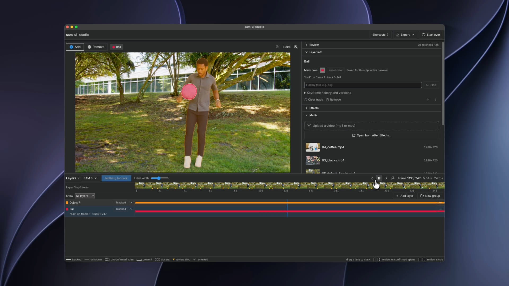

<!-- sam-ui (Apache-2.0). New file; Meta's original README is docs/SAM2_UPSTREAM.md. -->
# sam-ui

Interactive video segmentation on [SAM 2](https://github.com/facebookresearch/sam2)
and SAM 3, where **every object keeps its own cached track**. Click an object, press
Track, and only the objects that are new or changed get tracked again. Everything
else stays as it was, including after a reload or a server restart.



sam-ui began as a fork of Meta's SAM 2 web demo. The backend keeps Meta's model code
and adds a track cache, a second engine (SAM 3), exports and a job system. The
frontend, **studio**, replaces the demo UI with an editor layout.

## Download the app

**macOS 14 or newer, Apple Silicon (M1 or later):** get `sam-ui-<version>-arm64.dmg` from the
[latest release](https://github.com/VolksRat71/sam-ui/releases/latest) and drag it
into Applications.
- On first launch it downloads SAM 2.1 large (about 900 MB, hash-checked). The app
  runs the full model locally on your GPU, with no other install.
- The build is **not signed yet**: the first time, right-click the app and choose
  **Open** (macOS 14), or open it once and click **Open Anyway** in System Settings →
  Privacy & Security (macOS 15 and later), or run
  `xattr -dr com.apple.quarantine /Applications/sam-ui.app`.
- **SAM 3 (optional):** accept Meta's SAM License on
  [facebook/sam3](https://huggingface.co/facebook/sam3), then choose
  **SAM 3 → Download SAM 3 with a Hugging Face token…**. See
  [`desktop/README.md`](desktop/README.md).

**Or try it in the browser:** [volksrat71.github.io/sam-ui](https://volksrat71.github.io/sam-ui/)
runs SAM 2.1 tiny on WebGPU with no install, no server and nothing uploaded (your
video stays in the browser). Chrome or Edge on desktop; Safari and Firefox are
untested. It is a demo: clips up to 5 minutes, and the app's SAM 2.1 large and SAM 3
give much better masks. Or run it from source, below.

## Hardware

Memory does not grow with clip length: frames are decoded as tracking and playback
reach them, and tracking state keeps only what the model reads again. So what sets
the hardware floor is the model, not the clip. Figures are marked **measured** or
**estimated**. The minimums are estimates: they add the measured peak footprint
below to what macOS and the app's window need. They have not been tried on a Mac
with that much memory.

| | Minimum | Recommended | Notes |
|---|---|---|---|
| **App, SAM 2.1 large** (default) | 8 GB, with the feature cache off (`SAM_UI_FEATURE_CACHE_GB=0`); **estimated** from a **measured** 4.1 GB peak footprint | 16 GB | 0.68 to 0.72 s a frame on an M4 Max, 1.3 s on an M1 Pro (**measured**): a 5-minute clip at 24 fps (7,200 frames) takes about 1.4 hours per pass on the M4 Max, 2.5 on the M1 Pro. |
| **App, SAM 3** (optional) | 12 GB with `SAM_UI_SAM3_DTYPE=fp16`, **estimated** from a **measured** 5.7 GB peak for the app's worst case; 16 GB at full precision (6.7 GB peak), **measured** working on an M1 Pro, 16 GB | 16 GB or more | 1.35 s a frame at full precision, 0.8 at fp16 (M4 Max, **measured**). fp16 moves masks a little (below). |
| **Browser demo, SAM 2.1 tiny** | 8 GB; **measured** 2.7 to 3.6 GB for a 2-minute track | 16 GB | Chrome or Edge with WebGPU. About 46 ms a frame at 512 px, 252 ms at 1024, one object (**measured**). |

The app needs an Apple Silicon Mac (M1 or later) on macOS 14 or newer. Measured on a
3-minute 720p clip (4,320 frames, SAM 2.1 tiny, two objects): the backend's memory
stays at 3.0 to 3.3 GB from start to end, where the code this began from needed 7.8 GB
for 10 seconds and 17 GB for 30. `tools/memory_bench.py` reproduces the comparison.

**Measured** with `tools/hardware_bench.py` on an Apple M4 Max with 48 GB, macOS
26.6.2. Two objects clicked on frame 0. The clips are 1280x720: a 10 s or 60 s
synthetic one at 24 fps, and the gallery's dog and juggling clips (289 and 247
frames). The footprint is the backend process's peak physical footprint, the figure
macOS counts against memory, which includes the GPU's buffers (RSS does not). Each
row is its own process.

| Run | Load | Speed | MPS peak | Footprint peak |
|---|---|---|---|---|
| SAM 2.1 large, 10 s, 60 s and gallery clips | 0.9 s | 0.68 to 0.72 s/frame | 2.8 GB | 4.1 GB, the same at 10 s and 60 s |
| SAM 2.1 large, feature cache 3 GB (the default on a 12 GB Mac) | 0.9 s | 0.72 s/frame | 3.8 GB | 5.1 GB |
| SAM 3, 10 s and gallery clips | 3.5 s | 1.35 s/frame | 4.2 GB | 5.4 to 5.5 GB |
| SAM 3, 60 s clip (1,440 frames) | 3.4 s | 1.37 s/frame | 4.2 GB | 5.1 GB: flat, no higher than at 10 s |
| SAM 3 at fp16 or bf16, gallery and 10 s clips | 2.7 to 3.9 s | 0.79 to 0.80 s/frame | 2.0 GB | 3.5 GB |
| SAM 3 text prompt, "dog" | 2.5 s first (loads the detector), 0.7 s after | | 4.2 GB | 5.0 GB (4.5 at fp16) |
| App worst case: SAM 2.1 large (3 GB cache) tracks, then SAM 3 tracks and a text prompt, one process | | 1.37 s/frame (SAM 3) | 5.8 GB (3.8 at fp16) | 6.7 GB (5.7 at fp16) |

What SAM 3 keeps while idle, at full precision (fp16 in brackets): 2.5 GB (1.5) after
a job, 4.8 GB (2.8) with the text detector loaded, and under 1 GB once both are
unloaded. The detector is unloaded after 5 idle minutes and the whole engine after 10
(`SAM_UI_SAM3_DETECTOR_IDLE_S`, `SAM_UI_SAM3_IDLE_S`, in seconds, or `never`). The
next use loads them again in a few seconds. Neither setting changes a mask.

**Half precision is opt-in, because masks move.** IoU of each frame's mask against
full precision, on the same clips and clicks (`--save-masks`, then `--compare`):

| Setting | Mean IoU | Lowest IoU | Memory | Speed |
|---|---|---|---|---|
| `SAM_UI_SAM3_DTYPE=fp16` | 0.996 to 0.997 | 0.80, a ball under 1% of the frame | 3.5 GB peak, from 5.5 | 0.8 s/frame, from 1.35 |
| `SAM_UI_SAM3_DTYPE=bf16` | 0.99 | 0.78, the same ball | the same as fp16 | the same as fp16 |
| `SAM_UI_SAM2_DTYPE=fp16` (autocast) | 0.998 | 0.92, the dog at under 1% of the frame | no saving: 4.2 to 4.4 GB peak | 0.36 s/frame, from 0.69 |
| `SAM_UI_SAM2_DTYPE=bf16` (autocast) | 0.99 | 0.00, the same dog lost on one frame | no saving | 0.36 s/frame |

A text prompt's mask at fp16 keeps an IoU of 0.9996 against full precision, with the
same score. The desktop app passes its environment to the backend, so
`launchctl setenv SAM_UI_SAM3_DTYPE fp16` before starting it turns fp16 on there.

**Not measured:**
- Macs with 8, 12 or 16 GB, so the minimums above stay estimates. There is no such Mac
  here; the M1 Pro, 16 GB figures come from earlier runs.
- SAM 2.1 large on a 3-minute clip, and on 5 minutes on the M1 Pro. Footprint was flat
  from 10 s to 60 s, as it was for SAM 2.1 tiny on 3 minutes.
- Intel Macs, which the app does not support ([#7](https://github.com/VolksRat71/sam-ui/issues/7)).
- Windows, Linux and CUDA GPUs ([#6](https://github.com/VolksRat71/sam-ui/issues/6)):
  there is no build for them yet and no such machine here.

```sh
python tools/hardware_bench.py --runs sam2 sam3 sam3-text --clips synth:10 gallery:01_dog
python tools/hardware_bench.py --runs app --clips gallery:01_dog --feature-cache-gb 3 [--env SAM_UI_SAM3_DTYPE=fp16]
python tools/hardware_bench.py --runs sam3-idle --clips gallery:01_dog
python tools/hardware_bench.py --runs sam3 --clips gallery:05_default_juggle --save-masks /tmp/a
python tools/hardware_bench.py --runs sam3 --clips gallery:05_default_juggle --env SAM_UI_SAM3_DTYPE=fp16 --save-masks /tmp/b
python tools/hardware_bench.py --compare /tmp/a /tmp/b
```

## Platform support

| | Status |
|---|---|
| **Desktop app**, macOS 14+ on Apple Silicon | Released ([v0.2.0](https://github.com/VolksRat71/sam-ui/releases/latest)) |
| Desktop app, Intel Mac | Not supported ([#7](https://github.com/VolksRat71/sam-ui/issues/7)) |
| Desktop app, Windows or Linux | Not yet ([#6](https://github.com/VolksRat71/sam-ui/issues/6)) |
| **Browser demo**, Chrome on macOS | Tested |
| Browser demo, Chrome or Edge on Windows | Untested ([#2](https://github.com/VolksRat71/sam-ui/issues/2)) |
| Browser demo, Safari 26 | Untested ([#3](https://github.com/VolksRat71/sam-ui/issues/3)) |
| Browser demo, Firefox | WebGPU only on some versions; untested ([#4](https://github.com/VolksRat71/sam-ui/issues/4)) |
| Browser demo, Android Chrome | Known issue: blank preview ([#1](https://github.com/VolksRat71/sam-ui/issues/1)) |

Details and progress: [Platform support, #16](https://github.com/VolksRat71/sam-ui/issues/16).

## What it does

- **Per-object track cache.** Your clicks are saved as seeds, with the mask you
  approved on each clicked frame. Each object keeps one track per engine, in one of
  four states: untracked, stale (its clicks changed since), tracked, or tracking (a
  job holds it). Track runs only what isn't current.
- **Corrections that stick.** Click on any frame to fix a mask; the next Track uses
  your corrected mask on that frame. A correction refines the tracked mask, even
  after an earlier correction has made the track stale: a negative click, sent with
  a positive on the part to keep, cuts away only the region it is on, and a lone
  positive click adds one. SAM 2 needs a positive on the frame.
- **Re-track only what a correction changes.** On SAM 2, a correction re-tracks a
  stretch around the corrected frame and keeps the cached track beyond it: the pass
  starts a little before the frame, from the cached masks there, and stops once ten
  frames in a row agree with the cache (IoU above 0.98). On the gallery dog clip
  (289 frames) a fix on frame 148, a positive on the dog and a negative on the red
  pixel its mask took in, re-tracked 31 frames in 7.5 s, against 130 s for a full
  re-track, and on every re-tracked frame its masks were within IoU 0.987 of the
  full re-track's. SAM 2 lets a correction nudge distant frames too
  (the full re-track moved frame 55 to IoU 0.936 of the old track), and the kept
  frames stay as they were, so each track records which pass made each frame
  (`POST /track_provenance`) and the review lists the bounded stretches. A tracked
  object tracked again, or a job with `full: true`, re-tracks everything. SAM 3 and
  the browser engine re-track the whole window for now.
- **Absent ranges.** Mark a span of frames where an object is not in the shot (it
  left the frame, went behind something, or is gone after a cut). Those frames stay
  empty in the preview and in every export, the tracker never runs on them, and the
  range splits the object's track: each side is tracked only from its own clicks,
  so nothing seen before the gap carries into the frames after it. A side with no
  clicks stays empty. Marking or unmarking a range makes the track stale, and the
  re-track runs only the sides that changed. A positive click inside a range means
  the object is back, so the range ends on the frame before it; clicks there with no
  positive are refused. *Gone for a while?*, offered after a lone negative, marks the
  object absent from that frame until its next click.
- **Candidate and confirmed ranges.** Each frame of an object is *unknown* (nobody
  has said), a *candidate* (a model or tool thinks the object is there; it carries
  its source, such as `text:dog@sam3`, and maybe a score), confirmed *present*, or
  confirmed *absent*. Only absent changes tracking. Present and candidate ranges
  are annotations kept apart from the clicks (`annotations.json`): they never
  change a mask or a window, are not in the seeds hash, and so never make a track
  stale. Confirmed ranges override candidates; marking present clears absent there.
  A candidate can be confirmed present, confirmed absent (a seed change, so it can
  be undone, and undo shows the candidate again) or rejected. A discovery job
  writes candidates in bulk (`setObjectCandidates`, or `TrackService.write_candidates`).
  Exports record every range with its state; only absent frames are empty.
- **Undo, and earlier track versions.** Every finished track is kept as a version
  of its object, under the hash of the clicks that made it, and every click, cleared
  frame or range edit can be undone (Cmd-Z, Shift-Cmd-Z to redo). Going back to
  clicks a version was made from brings its track back from disk with no re-track,
  so undoing an accidental click restores the good track at once. Each object lists
  its kept versions (when, which engine, how many clicks) to go back to any of them,
  and clicks that went to the wrong object move to the right one, one undo step
  each. The last 10 versions per object and engine are kept; the version an object
  shows shares its track's files, so it costs no extra disk; an older one costs its masks (RLE): on the gallery
  dog clip (289 frames at 1280x720) 257 KB for one object tracked from one click,
  483 KB once a stray click grew it, plus about 1 to 3 KB for its seeds. An undo
  there took 13 ms, against 136 s for the track it brought back.
- **A review queue instead of every frame.** Each track gets a short, ranked list of
  stops worth a look, computed from the cached masks with no model run: where SAM 2
  and SAM 3 disagree, where the track starts, stops or the object comes back, where
  the mask's area or position jumps or it splits into pieces, the seams of a re-track
  near a correction, where a candidate range starts, and the frames flagged with F.
  Each stop carries its reasons and a score (weights in `tracks/audit.py`); nearby
  frames merge into one stop, absent ranges never hold one, and the queue is capped.
  *Looks right* marks a stop reviewed (`<object>/review.json`, outside the seeds
  hash); the mark holds only while the masks it covered are unchanged, so a
  correction's re-track reopens just the stops it remade, and an undo brings the
  marks back with the track. On the gallery dog clip (289 frames, one click) the
  SAM 2 track got 3 stops (where the dog leaves and re-enters at frames 77 and 102,
  and a split mask at 207), built in 0.11 s; with a SAM 3 track as well, the stop at
  102 also carried their disagreement. `POST /review_queue`, `POST /set_reviewed`;
  the roto export writes the queue into `data/review.json`.
- **Text prompts (SAM 3).** Type what to find ("dog") for the selected object and
  SAM 3's detector segments it on the frame on screen: the best match becomes that
  frame's mask, as if clicked, and the object tracks from it with any engine. When
  several things match it says how many and takes the best; a click there refines
  the mask. SAM 2 and the browser engine take clicks only, and the field says so.
  The detector shares SAM 3's backbone with the tracker, so it adds about 2 GB, and
  it is unloaded after 5 idle minutes (see Hardware).
- **Keep working while it tracks.** A track job holds the model one frame at a time,
  so clicks come back in about 0.1 s even while a job runs. Jobs can overlap, and
  each has its own cancel.
- **Two engines.** SAM 2 (default, and used for clicks) and SAM 3's video tracker
  (opt-in per Track, loaded on first use). Each engine's track is cached separately,
  and studio marks the frames where the two disagree.
- **Fast re-tracks.** Image-backbone features are cached per video and shared by
  every job, so a re-track skips the backbone (about 35% faster, same masks).
- **Long clips.** Uploads up to 5 minutes and 2 GB (`MAX_UPLOAD_VIDEO_DURATION`,
  `MAX_UPLOAD_MB`); a longer clip keeps its start, and studio says so before it
  uploads. Memory stays flat however long the clip (see Hardware).
- **Studio:**
  - up to 16 objects, each with a name you can edit in place (exports use it);
  - an engine picker that lists every model and says why one can't run here;
  - per-object effects from Meta's demo;
  - a timeline with a lane per object;
  - uploads, and deleting uploads;
  - zoom, with click markers that stay sharp at any zoom.
- **Exports** (each records the engine and model that made it):
  - **Mask videos:** one black and white MP4 per object, in a zip.
  - **Vector JSON:** per-frame outlines (pieces and holes) per object, for After
    Effects masks.
  - **Rotoscoping working folder:** `products.json`, `anchors.json`, `shots.json`
    and per-object mattes (`data/mattes_tracked/<id>/%05d.png`), optionally with
    the frames.
  - **Video:** an MP4 with each object's effect, encoded in the browser.
  - **After Effects:** coming.

## Quick start

Needs Python 3.11+, Node 20+ and ffmpeg. Tested on Apple Silicon (MPS); CUDA and
CPU work as they do in SAM 2.

```sh
git clone https://github.com/VolksRat71/sam-ui.git && cd sam-ui
python3 -m venv .venv && . .venv/bin/activate
SAM2_BUILD_CUDA=0 pip install -e '.[interactive-demo]'
(cd checkpoints && ./download_ckpts.sh)          # SAM 2.1 checkpoints (Apache-2.0)
git config core.hooksPath .githooks               # the footage guard, for contributors
```

**Backend.** Run it as a single process. Do not use gunicorn on macOS: a forked
worker cannot reach the Metal compiler and fails on its first GPU call.

```sh
mkdir -p ~/sam-ui-data && ln -s "$PWD/demo/data/gallery" ~/sam-ui-data/gallery
cd demo/backend/server
PYTORCH_ENABLE_MPS_FALLBACK=1 APP_ROOT="$(git rev-parse --show-toplevel)" \
MODEL_SIZE=large DATA_PATH=~/sam-ui-data API_URL=http://localhost:7263 \
DEFAULT_VIDEO_PATH=gallery/05_default_juggle.mp4 \
python -m flask --app app run --host 127.0.0.1 --port 7263 --with-threads
```

**Studio:**

```sh
cd studio && npm ci
VITE_API_ENDPOINT=http://127.0.0.1:7263 npm run dev -- --port 7262   # http://localhost:7262
```

**SAM 3 (optional).** `pip install "transformers==5.17.0"`, then put the SAM 3 weights
(from [facebook/sam3](https://huggingface.co/facebook/sam3), after accepting Meta's
SAM License) in a folder and set `SAM_UI_SAM3_WEIGHTS=/path/to/sam3`. The SAM 3
option in studio stays disabled, with the reason shown, until they're found.

| Setting | Default | What it does |
| --- | --- | --- |
| `SAM_UI_FEATURE_CACHE_GB` | 6 | backbone feature cache budget (0 turns it off) |
| `SAM_UI_SESSION_TTL_MIN` | 30 | idle sessions are freed after this long (0 keeps them) |
| `SAM_UI_EXPORT_ROOT` | `~/Movies/sam-ui` (the desktop app sets your home folder) | rotoscoping exports may only write under this folder |
| `SAM_UI_SAM3_WEIGHTS` | `~/.cache/rotoscoping-video-subjects/weights/sam3-hf` | where the SAM 3 weights are |
| `SAM_UI_SAM3_DTYPE` | `fp32` | SAM 3's precision: `fp16` or `bf16` cut its memory and time, and move masks a little (see Hardware) |
| `SAM_UI_SAM2_DTYPE` | `fp32` | SAM 2's autocast on MPS: `fp16` or `bf16` halve its time, save no memory and move masks a little |
| `SAM_UI_SAM3_IDLE_S` | 600 | seconds before an unused SAM 3 is unloaded (`never` keeps it) |
| `SAM_UI_SAM3_DETECTOR_IDLE_S` | 300 | seconds before SAM 3's unused text detector is unloaded (`never` keeps it) |

## How it fits together

```
studio (React, Vite, WebCodecs)                 demo/backend/server (Flask)
  UI ── StudioMethods ── studio.worker ── HTTP ──►  GraphQL: sessions, clicks, objects, uploads
                         decode, masks,             tracks/: seeds, track store, engines,
                         effects, export                     jobs, feature cache, export
                                                    sam2/  (Meta's model code)
```

- **`demo/backend/server/tracks/`:**
  - `seeds.py` and `store.py`: seeds and per-engine tracks on disk, under
    `DATA_PATH/tracks/<video sha256>/<object>/`;
  - `service.py`: selects what to track, caches the results, computes disagreement;
  - `engine.py` / `sam3_engine.py`: the engines;
  - `jobs.py`: job claims and cancel;
  - `features.py`: the backbone cache;
  - `export.py` and `routes.py`: exports and the HTTP routes.
- **`studio/`.** The UI talks to the backend only through the `StudioMethods` table
  (`src/worker/protocol.ts`), which the upcoming in-browser engine will implement
  as well. Meta's demo code it reuses is vendored under `src/meta/`.

### API, in brief

| Kind | Endpoints |
| --- | --- |
| GraphQL, `POST /graphql` | `startSession` (returns the objects already known for the video), `addPoints` (points normalised 0–1), `clearPointsInFrame`, `removeObject`, `clearPointsInVideo`, `objectTracks` (with each object's `history`: undo, redo, kept versions, and its `ranges` by state), `clearTrack`, `setObjectRange` (absent, present, or candidate with `source` and `score`; null clears, `clear` limits which states), `setObjectCandidates` (candidates in bulk), `undoSeeds`, `redoSeeds`, `restoreVersion`, `moveClicks`, `uploadVideo`, `deleteVideo`, `videos`, `defaultVideo` |
| Streams, `multipart/x-savi-stream` | `POST /track_objects {session_id, object_ids?, engine?}` streams one part per frame and ends with a `done` or `error` part. `POST /track_masks` streams cached tracks. |
| JSON | `GET /engines` (every engine, with why one can't run), `GET /limits` (upload length and size), `POST /cancel_track`, `POST /track_jobs`, `POST /track_disagreement`, `POST /rename_object`, `POST /object_names`, `POST /object_layout`, `POST /set_object_layout`, `POST /export` |

## Tests

```sh
pytest demo/backend/tests -q                         # backend, no model needed
SAM_UI_SLOW=1 PYTORCH_ENABLE_MPS_FALLBACK=1 pytest demo/backend/tests -q -k "slow or streamed"
                                                     # + real SAM 2 / SAM 3: streamed and pruned tracks
                                                     #   give the same masks as upstream on every frame
cd studio && npm test && npm run lint && npm run build
npm run smoke                                        # end to end in headless Chrome
SMOKE=both npm run smoke                             # + the browser-only build (headed Chrome, WebGPU)
CLIP_SECONDS=300 SERVE=dist-pages npm run memory     # browser build: memory and IoU over a long track
python tools/memory_bench.py --seconds 10 60 180     # peak memory against clip length
python tools/hardware_bench.py --runs sam2 sam3 sam3-text --clips gallery:01_dog   # the Hardware figures
python tools/track_cache_e2e.py --api http://127.0.0.1:7373   # live backend (use a scratch one)
```

`tools/track_cache_e2e.py` uploads its own synthetic clips and deletes them when it
finishes. It also has `--after-restart`, `--correction`, `--responsive`,
`--absent`, `--bounded` and `--undo` checks.

## Licences and credits

- sam-ui is **Apache-2.0**, like SAM 2. It is a modified version of
  [SAM 2](https://github.com/facebookresearch/sam2) by Meta Platforms, Inc.
  [`NOTICE-sam-ui.md`](NOTICE-sam-ui.md) lists what changed. Files we modified carry
  a notice, and Meta's copyright headers are kept.
- **SAM 3 is not included.** Its code and weights are under Meta's
  [SAM License](https://huggingface.co/facebook/sam3), not Apache. sam-ui imports
  Hugging Face `transformers` at run time and loads weights you download yourself.
- The Inter font is under the SIL Open Font License; the licence ships with it in
  `studio/public/fonts/`.
- Meta's original README, with the model details, checkpoints and training, is
  [`docs/SAM2_UPSTREAM.md`](docs/SAM2_UPSTREAM.md).
